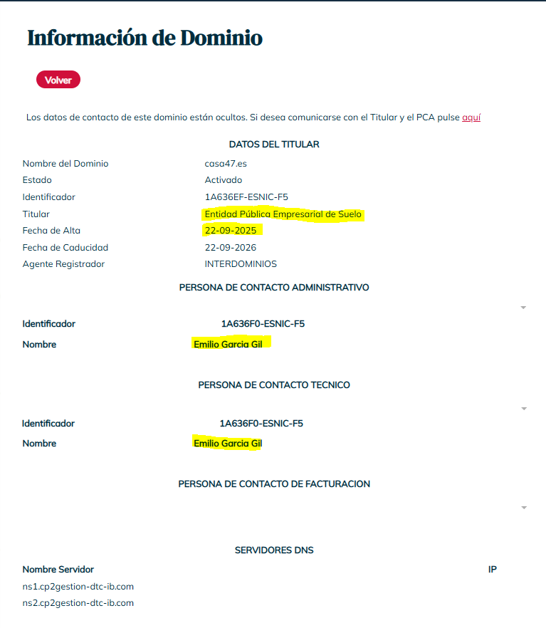
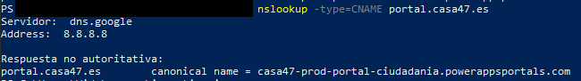

# <b>CASA47</b>

Fecha: 07-09-2026
Estado: En curso

## <b>Lo que se investiga</b>
En esta primera investigación vamos a intentar descubrir todos los datos posibles del dominio: 
[CASA47](https://portal.casa47.es/) <b>https://portal.casa47.es</b>  y todo lo relacionado con su contratación y demás información que sea de utilidad


## <b>Hallazgos</b>
- Lo primero que se debe hacer al investigar cualquier dominio es realizar un whois para ver qué tenemos delante. En este caso, al ser un dominio .es tenemos que ir a [dominios.es](https://www.dominios.es/es).<br><br>

- Podemos ver que el titular del dominio es el ya extinto [SEPES](https://es.wikipedia.org/wiki/CASA_47) (Entidad Pública Empresarial de Suelo) renombrado a casa47 por motivos ideológicos al referirse directamente al artículo 47 de la Constitución.
- El dominio se registró el 22 de septiembre de 2025 que nos puede ser útil cuando comprobemos el contrato de la web e infraestructura.
- Aparece el nombre de [Emilio García Gil](https://www.linkedin.com/in/emilio-garcia-gil-1bb16521/), que, haciendo una búsqueda rápida en Google nos muestra que es el encargado directo de Sistemas y Comunicaciones de SEPES 


- El siguiente paso es reconstruir el DNS para averigurar qué registros existen y saber si el CNAME ha pasado por infraestructuras distintas desde 2025. Estos son los comandos que vamos a utilizar y que, a continuación, se explica brevemente su funcionamiento:
```bash
nslookup -type=CNAME portal.casa47.es
nslookup -type=A portal.casa47.es
nslookup -type=AAAA portal.casa47.es
nslookup -type=TXT portal.casa47.es
nslookup -type=NS casa47.es
nslookup -type=MX casa47.es


```

- El primer comando nos da información muy relevante sobre el registro CNAME que redirige al dominio público:
Nos encontramos ante un backend de [Microsoft Power Pages](https://www.microsoft.com/es-es/power-platform/products/power-pages/) en el que se integra de forma nativa [Dataverse](https://www.microsoft.com/es-es/power-platform/dataverse) para implementar el SIG correspondiente.
Podemos inferir que es un entorno de producción para el público.



- Punto 2

## Comandos


## Capturas

Sustituye el bloque de color pegando aquí tu pantallazo real (Ctrl+V).

## Archivos
- [Notas de ejemplo](../archivos/notes.txt)

## Siguientes pasos
- [ ] Leer X
- [ ] Probar Y