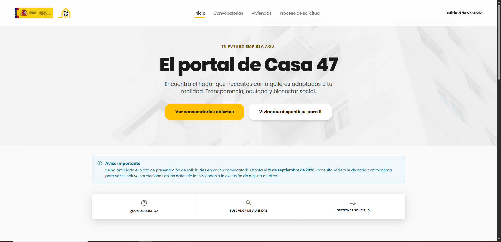
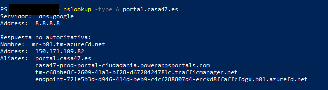
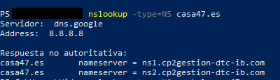
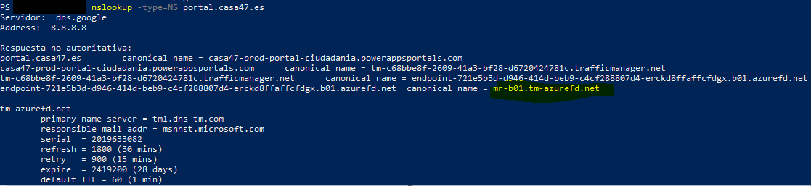
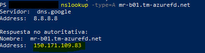
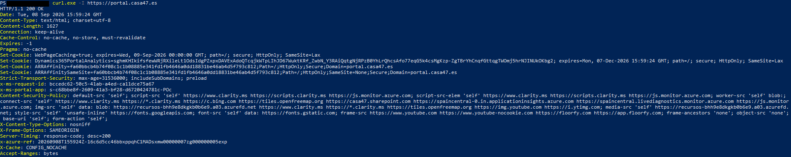
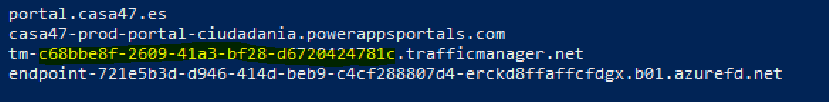
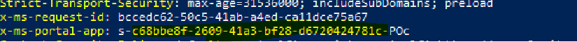
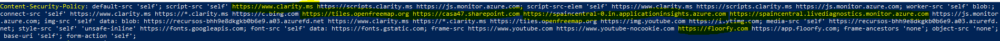

<<<<<<< HEAD
# <b>CASA47</b>

Fecha: 07-09-2026
Estado: En curso

## <b>Lo que se investiga</b>
En esta primera investigación vamos a intentar descubrir todos los datos posibles del dominio: 
[CASA47](https://portal.casa47.es/) <b>https://portal.casa47.es</b>  y todo lo relacionado con su contratación y demás información que sea de utilidad


## <b>Hallazgos</b>
###Whois
- Lo primero que se debe hacer al investigar cualquier dominio es realizar un whois para ver qué tenemos delante. En este caso, al ser un dominio .es tenemos que ir a [dominios.es](https://www.dominios.es/es).<br><br>

- Podemos ver que el titular del dominio es el ya extinto [SEPES](https://es.wikipedia.org/wiki/CASA_47) (Entidad Pública Empresarial de Suelo) renombrado a casa47 por motivos ideológicos al referirse directamente al artículo 47 de la Constitución.
- El dominio se registró el 22 de septiembre de 2025 que nos puede ser útil cuando comprobemos el contrato de la web e infraestructura.
###OSINT
- Aparece el nombre de [Emilio García Gil](https://www.linkedin.com/in/emilio-garcia-gil-1bb16521/), que, haciendo una búsqueda rápida en Google nos muestra que es el encargado directo de Sistemas y Comunicaciones de SEPES 

###DNS
- El siguiente paso es reconstruir el DNS para averigurar qué registros existen y saber si el CNAME ha pasado por infraestructuras distintas desde 2025. Estos son los comandos que vamos a utilizar y que, a continuación, se explica brevemente su funcionamiento:
```bash
nslookup -type=CNAME portal.casa47.es
nslookup -type=A portal.casa47.es
nslookup -type=AAAA portal.casa47.es
nslookup -type=TXT portal.casa47.es
nslookup -type=NS casa47.es
nslookup -type=MX casa47.es


```

```bash
nslookup -type=CNAME portal.casa47.es
```

- El primer comando nos da información muy relevante sobre el registro CNAME que redirige al dominio público:
La resolución CNAME apunta a powerappsportals.com, lo que permite identificar el servicio como Microsoft Power Pages. Power Pages puede integrarse con Dataverse y otros servicios de Microsoft, aunque la utilización concreta de Dataverse deberá verificarse mediante otras evidencias de la aplicación.
Nos encontramos ante un backend de [Microsoft Power Pages](https://www.microsoft.com/es-es/power-platform/products/power-pages/) en el que se integra de forma nativa [Dataverse](https://www.microsoft.com/es-es/power-platform/dataverse) para implementar el SIG correspondiente.
Podemos inferir que es un entorno de producción para el público.


```bash
nslookup -type=A portal.casa47.es
```

- El segundo comando nos devuelve la IPv4 <b>(150.171.109.82) </b>correspondiente al nombre mr-b01.tm-azurefd.net. Pertenece a la infraestructura utilizada por Azure Front Door y no debe interpretarse como la IP del servidor donde se ejecuta la aplicación.
Sería un ejercicio interesante saber dónde está realmente alojada la aplicación.


En este caso, vamos a intentar averiguar dónde se encuentra alojada realmente. <br> El primer paso es ejecutar el siguiente comando contra casa47.es y portal.casa47.es para saber cuales son los servidores DNS autoritativos: <br>
```bash
nslookup -type=NS casa47.es
nslookup -type=NS portal.casa47.es
```
¿Quién gestiona el DNS de casa47.es?<br>
<br>
Nos encontramos con dos servidores DNS que investigaremos más adelante:<br>
	- ns1.cp2gestion-dtc-ib.com<br>
	- ns2.cp2gestion-dtc-ib.com<br><br>
¿Quién gestiona el DNS de portal.casa.47.es<br>
<br>
portal.casa47.es es un hostname dentro de la zona casa47.es, no es una zona DNS delegada independiente.
Para comprobar si portal.casa47.es constituye una delegación DNS independiente, se consulta su registro NS. En este caso no obtenemos una delegación independiente equivalente a la de casa47.es; la resolución del hostname nos conduce a la cadena de nombres de Microsoft Azure.<br>


Con el anterior comando hemos llegado al servidor DNS "final" y podemos descubrir la IP con _nslookup -type=A_:<br>
<br>

Al repetir la consulta, mr-b01.tm-azurefd.net puede resolver a otra dirección, en nuestro caso 150.171.109.83. Esto indica que estamos ante una infraestructura distribuida y que la IP obtenida representa un punto de acceso de Azure, no necesariamente un servidor único.


Vamos a ejecutar un curl -I para enviar una solicitud HTTP HEAD para que el servidor nos responda solamente con los encabezados y obviar el cuerpo de la página.
<br>

Tenemos varias cosas interesantes para investigar y pararnos. Vamos a fijarnos en el parámetro _x-ms-portal-app_ que es una cabecera de Microsoft que identifica una instancia. Si nos fijamos atentamente coincide perfectamente
con lo que hemos sacado anteriormente del DNS.<br>
<br>
<br>

Al coincidir el identificador es una pista muy fuerte de que el dominio está asociado directamente a una instancia de [Microsoft Power Pages](https://www.microsoft.com/es-es/power-platform/products/power-pages/).

Revisando el parámetro [_Content Security Policy_](https://developer.mozilla.org/en-US/docs/Web/HTTP/Guides/CSP) se pueden categorizar varias partes que vamos a revisar por menorizado: <br>
<br>

- https://www.clarify.ms --> Analítica web de Microsoft<br>
- https://openfreemap.org --> Mapas gratuitos de código abierto (los mapas que se utilizan para ubicar los pisos)<br>
- https://casa47.sharepoint.com --> El portal tiene permitido realizar conexion con un Sharepoint, lo que puede implicar que en la arquitectura existan varios servicios de Microsoft.<br>
- https://spaincentral.livediagnostics.monitor.azure.com  --> Monitorización asociada a España, no implica que la aplicación está alojada en España<br>
- https://floorfy.com --> Software inmobiliario para crear tours virtuales<br>

En resumen...<br>


| Capa | | Lo que hemos descubierto |
|:---------|:---------|:---------|
| Dominio | | <span style="background-color: #828181; border-radius: 6px; padding: 2px 6px; display: inline-block;">portal.casa47.es</span> |     
|DNS autoritativo | | <span style="background-color: #828181; border-radius: 6px; padding: 2px 6px; display: inline-block;">ns1/ns2.cp2gestion-dtc-ib.com</span> |
|Plataforma | | Microsoft Power Pages |
|CNAME | | <span style="background-color: #828181; border-radius: 6px; padding: 2px 6px; display: inline-block;">powerappsportals.com</span> |
|Routing | | Azure Traffic Manager |
|Frontend |	| Azure Front Door |
|IP frontend | |  <span style="background-color: #828181; border-radius: 6px; padding: 2px 6px; display: inline-block;">150.171.109.82</span>,  <span style="background-color: #828181; border-radius: 6px; padding: 2px 6px; display: inline-block;">150.171.109.83</span> |
|Aplicación | | Microsoft Power Pages |
|Identificador del portal |	|  <span style="background-color: #828181; border-radius: 6px; padding: 2px 6px; display: inline-block;">c68bbe8f-2609-41a3-bf28-d6720424781c |
|Cookies |	|  <span style="background-color: #828181; border-radius: 6px; padding: 2px 6px; display: inline-block;">ARRAffinity |
|Monitorización| | Azure Application Insights |
|Región observada| |Spain Central|
|IP de origen| |<b>No expuesta públicamente</b>|
|Servidor físico | | <b>No identificable mediante DNS público</b>|

####Conclusión de la investigación DNS
La investigación DNS permite determinar que portal.casa47.es utiliza Microsoft Power Pages como plataforma de publicación y que su tráfico se encuentra integrado en una infraestructura de Microsoft Azure basada en Azure Traffic Manager y Azure Front Door.

El dominio casa47.es utiliza como servidores DNS autoritativos ns1.cp2gestion-dtc-ib.com y ns2.cp2gestion-dtc-ib.com, mientras que el subdominio portal.casa47.es está configurado mediante una cadena de registros CNAME que termina en infraestructura de Azure.

Las direcciones 150.171.109.82 y 150.171.109.83 obtenidas durante las consultas DNS no deben considerarse la dirección IP del servidor de aplicación. Corresponden a la infraestructura frontal de Azure y pueden variar debido a la naturaleza distribuida del servicio.

Las cabeceras HTTP obtenidas mediante curl aportan evidencias adicionales de la utilización de Power Pages, especialmente mediante las cabeceras x-ms-portal-app, x-azure-ref y las cookies ARRAffinity.

Por tanto, no es posible determinar mediante DNS público la dirección IP del servidor físico o instancia concreta que ejecuta la aplicación. La infraestructura de origen está abstraída por Microsoft como parte de un servicio PaaS gestionado.

###Certificado
## Comandos


## Capturas

Sustituye el bloque de color pegando aquí tu pantallazo real (Ctrl+V).

## Archivos
- [Notas de ejemplo](../archivos/notes.txt)

## Siguientes pasos
- [ ] Leer X


## Comandos


## Capturas

Sustituye el bloque de color pegando aquí tu pantallazo real (Ctrl+V).

## Archivos
- [Notas de ejemplo](../archivos/notes.txt)

## Siguientes pasos
- [ ] Leer X
>>>>>>> efb5b44647065ca50824a5e131352df31b98d35a
- [ ] Probar Y