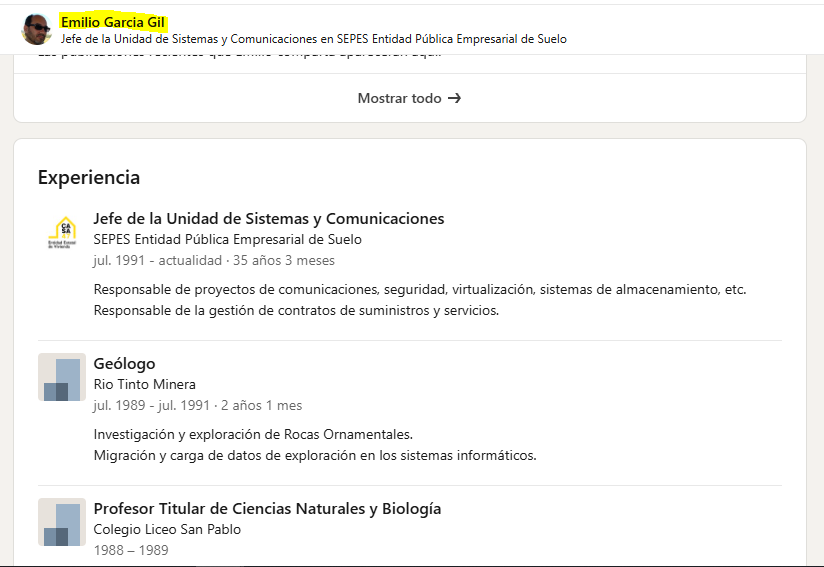

# CASA47

Fecha: 2026-09-07  
Estado: en curso

## Objeto de la investigación

Recopilar evidencias públicas sobre [portal.casa47.es](https://portal.casa47.es/), su infraestructura visible, contratación y otros datos de contexto relevantes.


## Hallazgos

### Titularidad y contexto

- Para dominios `.es`, la consulta de titularidad se realiza en [dominios.es](https://www.dominios.es/es).
- La información pública identifica al titular como la entidad antes denominada SEPES. La denominación Casa47 hace referencia al artículo 47 de la Constitución.
- El dominio se registró el 22 de septiembre de 2025. Esa fecha es útil para comparar la infraestructura publicada y la contratación relacionada.


### OSINT

- Una búsqueda pública muestra a [Emilio García Gil](https://www.linkedin.com/in/emilio-garcia-gil-1bb16521/) como responsable de Sistemas y Comunicaciones de SEPES.



### DNS e infraestructura publicada

Las consultas realizadas fueron:

```bash
nslookup -type=CNAME portal.casa47.es
nslookup -type=A portal.casa47.es
nslookup -type=AAAA portal.casa47.es
nslookup -type=TXT portal.casa47.es
nslookup -type=NS casa47.es
nslookup -type=MX casa47.es
```

El CNAME de `portal.casa47.es` apunta a `powerappsportals.com`, lo que constituye evidencia de Microsoft Power Pages. La plataforma puede integrarse con Dataverse, aunque esa integración concreta requiere evidencia adicional.


La consulta A devolvió `150.171.109.82` para `mr-b01.tm-azurefd.net`. Es una dirección de Azure Front Door; no debe considerarse la IP del servidor de aplicación.


Los DNS autoritativos de `casa47.es` son `ns1.cp2gestion-dtc-ib.com` y `ns2.cp2gestion-dtc-ib.com`.


`portal.casa47.es` es un hostname dentro de la zona `casa47.es`, no una zona delegada de forma independiente. La cadena termina en infraestructura de Microsoft Azure.


La resolución de `mr-b01.tm-azurefd.net` puede variar, por ejemplo a `150.171.109.83`. Esto es coherente con infraestructura distribuida y no identifica una máquina de origen.


Una petición HTTP `HEAD` expone cabeceras útiles para la atribución tecnológica.


La cabecera `x-ms-portal-app` coincide con el identificador observado en la infraestructura de Power Pages, una señal fuerte de asociación entre el dominio y esa instancia.


La política Content Security Policy enumera dependencias visibles que requieren interpretación prudente:

- `clarify.ms`: analítica de Microsoft.
- `openfreemap.org`: mapas de código abierto.
- `casa47.sharepoint.com`: un origen autorizado de SharePoint; no prueba por sí solo el uso concreto del servicio.
- `spaincentral.livediagnostics.monitor.azure.com`: telemetría asociada a Spain Central; no acredita que la aplicación esté alojada físicamente en España.
- `floorfy.com`: servicio de recorridos virtuales inmobiliarios.


| Capa | Evidencia observada |
| --- | --- |
| Dominio | `portal.casa47.es` |
| DNS autoritativo | `ns1/ns2.cp2gestion-dtc-ib.com` |
| Plataforma | Microsoft Power Pages |
| CNAME | `powerappsportals.com` |
| Routing | Azure Traffic Manager |
| Frontend | Azure Front Door |
| IP frontal | `150.171.109.82`, `150.171.109.83` |
| Identificador del portal | `c68bbe8f-2609-41a3-bf28-d6720424781c` |
| Cookies | `ARRAffinity` |
| Monitorización | Azure Application Insights |
| Región observada | Spain Central |
| IP de origen | No expuesta públicamente |
| Servidor físico | No identificable mediante DNS público |

### Conclusión DNS

La evidencia pública indica que `portal.casa47.es` utiliza Microsoft Power Pages y una infraestructura de Azure con Azure Traffic Manager y Azure Front Door. Las IP obtenidas corresponden a la capa frontal distribuida, no a un servidor de origen verificable. Las cabeceras HTTP, incluidas `x-ms-portal-app`, `x-azure-ref` y la cookie `ARRAffinity`, aportan señales adicionales de Power Pages.

No es posible determinar mediante DNS público la dirección IP del servidor físico o la instancia concreta que ejecuta la aplicación: es un servicio PaaS gestionado y la infraestructura de origen queda abstraída.

## Próximos pasos

- [ ] Registrar el certificado TLS y su cadena de confianza.
- [ ] Documentar recursos y respuestas visibles en la pestaña Network del navegador.
- [ ] Buscar fuentes públicas de contratación relacionadas con la plataforma o proveedores identificados.
- [ ] Separar evidencias confirmadas de hipótesis que requieran corroboración.
